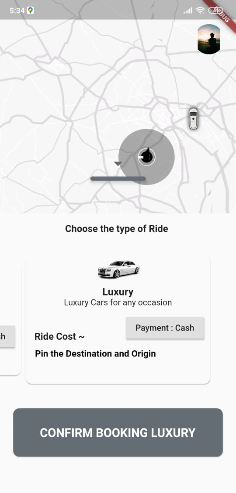
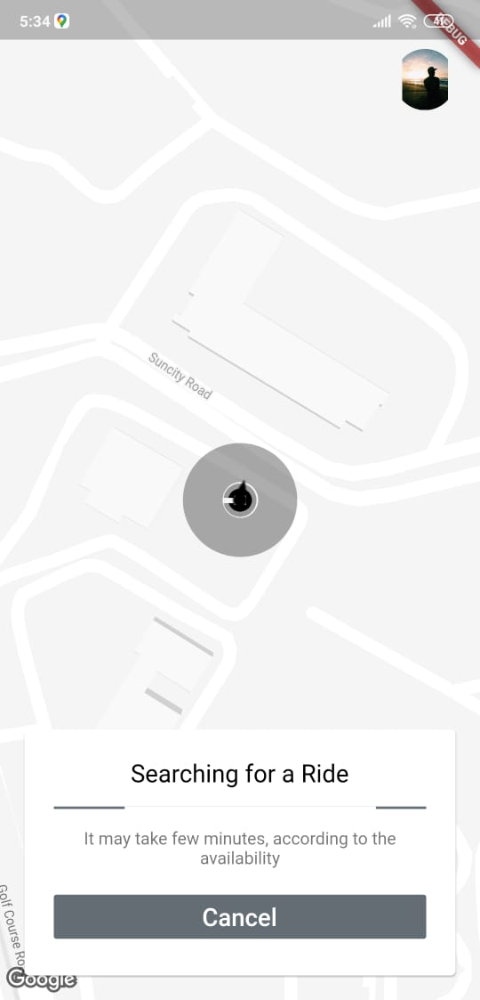
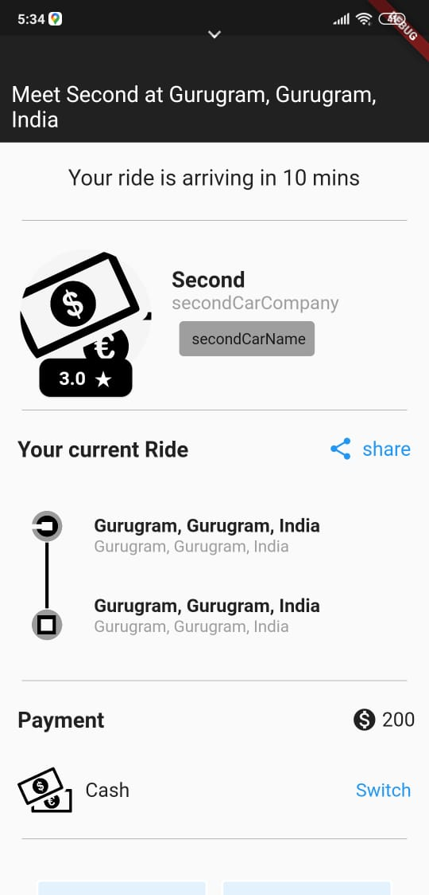
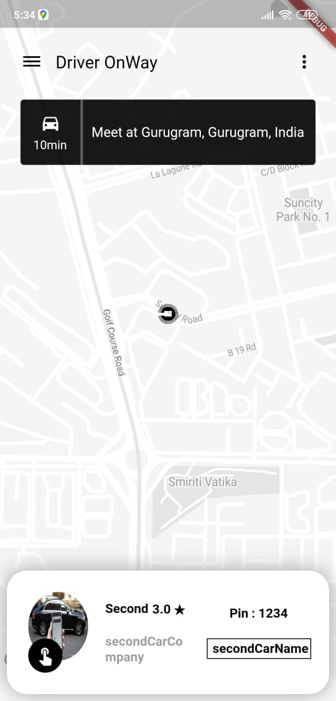
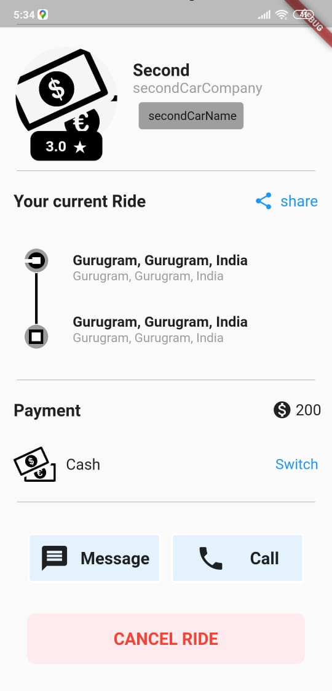
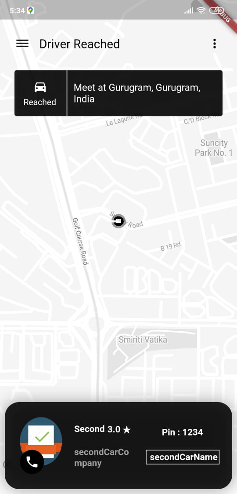
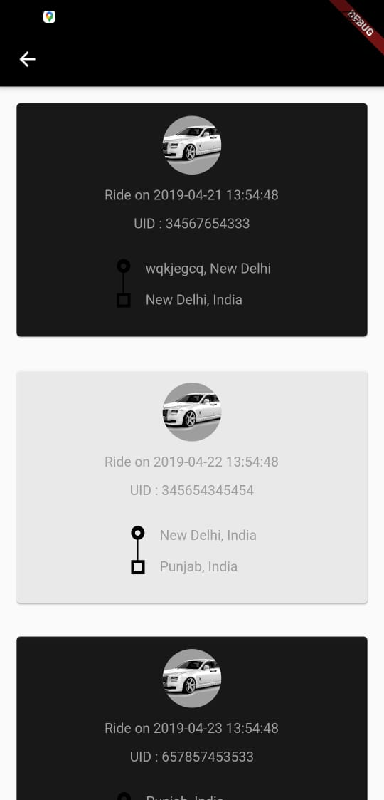
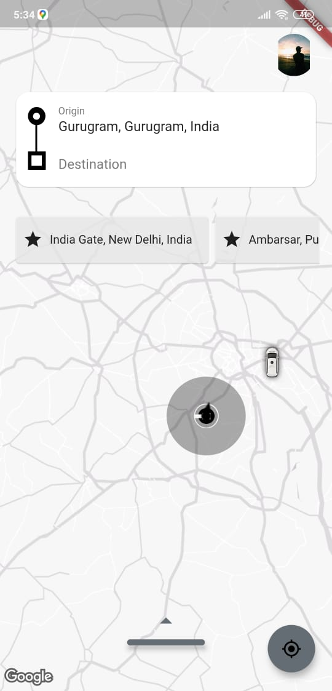

# World One - Taxi booking App UI!

## ScreenShots

### Features
Some of the listed features implemented are :
* Automatic Zoom IN/Out on certain actions.
* Polyline Generation from current position to provided location.
* Places search form the destination TextField. (drop down list to show 5 places related to the search keywords).
* Payment Selector from different method.
* Cab selection and cost estimator (dummy).
* Custom map style, like Uber.
